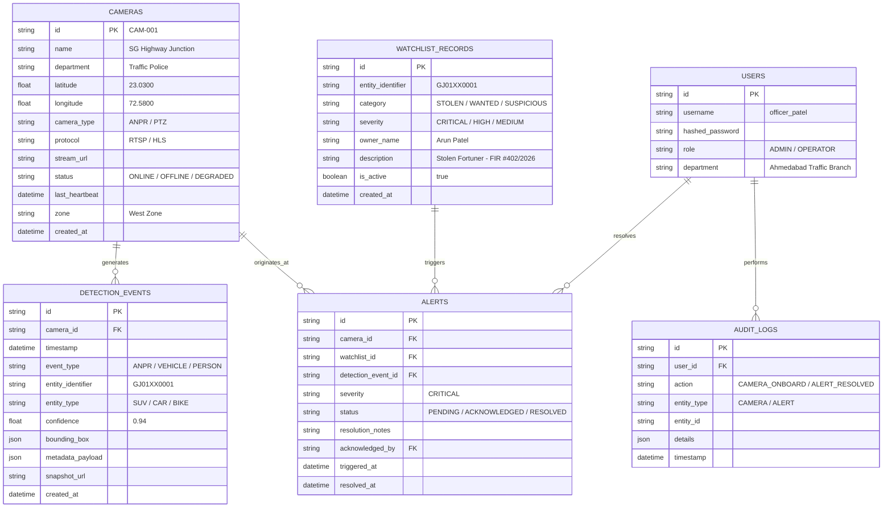

# Implementation Plan: okDriver CCTV Video Analytics & Real-Time Alert Platform
**Hiring Challenge & Gujarat Police Innovation Hackathon 2026 Aligned**

---

## 1. Executive Summary & Solution Vision

The **okDriver CCTV Monitoring & Video Analytics Platform** is a mission-critical, enterprise-grade Command & Control Center (C4I) software layer. It bridges heterogeneous camera streams (RTSP, HLS, ONVIF, dashcam feeds), AI edge analytics (ANPR, vehicle classification, object detection), real-time GIS tracking, watchlist correlation, and instant operator alerting into a single unified web application.

Designed to fulfill the Gujarat Police Hackathon 2026 requirements, this prototype demonstrates an operational end-to-end flow with realistic camera feeds, real-time WebSocket synchronization, automated vehicle tracing across checkpoints (e.g., Ahmedabad Junctions to RTO checkpoints), and a clear architectural path scaling up to **80,000 cameras**.

```
+--------------------------------------------------------------------------------------------------+
|                                    MISSION CONTROL WEB UI (React)                                |
|  +--------------------+  +----------------------+  +---------------------+  +-----------------+  |
|  | Multi-Stream Grid  |  | GIS Live & Trajectory|  | Real-Time Alerts HUD|  | Camera Registry |  |
|  +--------------------+  +----------------------+  +---------------------+  +-----------------+  |
+-------------------------------------------------+------------------------------------------------+
                                                  | WebSocket (Events & Alerts) + REST APIs
                                                  v
+--------------------------------------------------------------------------------------------------+
|                                  BACKEND API GATEWAY (FastAPI)                                   |
|  +--------------------+  +----------------------+  +---------------------+  +-----------------+  |
|  | Stream & Cam Mgmt  |  | AI Ingestion Router  |  | Watchlist Matcher   |  | GIS & Tracking  |  |
|  +--------------------+  +----------------------+  +---------------------+  +-----------------+  |
+-------------------------------------------------+------------------------------------------------+
             ^                                    |                           |
             | Video Metadata / WebRTC / HLS      v Storage (SQL / Cache)     v Real-Time Broadcast
+------------+-------------+              +-------+---------+        +--------+--------+
| HETEROGENEOUS CAMERAS   |              |  Database Layer |        | WebSocket Hub   |
| - Traffic Junction (SG) |              | - Cameras       |        | (Pub/Sub & SSE) |
| - RTO Checkpoint (GJ01) |              | - Detections    |        +-----------------+
| - Kalupur Station (GJ02)|              | - Watchlist     |
| - Mock Edge RTSP/HLS    |              | - Alerts & Audit|
+-------------------------+              +-----------------+
             ^
             | AI Metadata Feeds (ANPR / BBoxes)
+------------+-------------+
| AI SIMULATOR / EDGE AGENT|
| - License Plate OCR      |
| - Vehicle / Person Detect|
+-------------------------+
```

---

## 2. Recommended Tech Stack & Rationale

| Layer | Recommended Choice | Rationale & Justification |
| :--- | :--- | :--- |
| **Backend** | **Python (FastAPI)** | Native async event loop, optimal for high-throughput AI metadata ingestion, automatic OpenAPI/Swagger docs, high performance, and okDriver's primary stack requirement. |
| **Database** | **SQLite (Dev) / PostgreSQL (Prod)** | Standard SQLAlchemy ORM abstraction allowing zero-config local prototyping that seamlessly migrates to AWS RDS PostgreSQL / TimescaleDB for spatial indexing. |
| **Real-time Eventing** | **WebSockets (`FastAPI WebSocketHub`)** | Zero-latency, bi-directional event distribution to operators for live detections, critical watchlist hits, and camera heartbeat state transitions without page refresh. |
| **Frontend UI** | **React + Vite (Modern Dark C4I Theme)** | High-density operational dashboard; crisp, responsive, low-latency rendering for multiple video streams, telemetry feeds, and event logs. |
| **Styling & UI Tokens** | **Modern Vanilla CSS & Glassmorphism Tokens** | Bespoke mission-control palette (deep slate `#0a0f1d`, neon alert accents `#ff3366`, telemetry green `#00e676`), avoiding generic CSS frameworks while delivering modern aesthetics. |
| **GIS & Mapping** | **Leaflet + OpenStreetMap** | Lightweight, open-source, zero API keys required, custom SVG pulse markers for camera health/alert states, and interactive route polylines for vehicle movement tracing. |
| **Video Ingestion** | **Simulated HLS / MP4 Loop / Canvas Overlay** | Modular Stream Adapter pattern capable of playing live loop CCTV feeds with dynamic Canvas bounding box overlays, easily swappable with RTSP/WebRTC gateways (MediaMTX / go2rtc). |
| **AI Stream Simulation** | **Autonomous Python Event Generator** | Realistic multi-camera traffic feed generator emitting structured ANPR detections, confidence scores, bounding boxes, and timestamped routes for test vehicles (e.g. `GJ01XX0001`). |

---

## 3. Core Functional Modules & Implementation Details

### Module 1: Camera Registry & Onboarding
- **Data Attributes**: Camera ID (`CAM-001`), Name, Department (Traffic Police, RTO, Municipal Corp, Smart City), Latitude, Longitude, Camera Type (Fixed, PTZ, ANPR, Dashcam), Protocol (RTSP, HLS, WebRTC, ONVIF), Stream URL, Status (`Online`, `Offline`, `Degraded`), Heartbeat Timestamp, Zone, Storage Profile.
- **Capabilities**:
  - Manual CRUD via Modal UI with validation.
  - Bulk / API-based onboarding (`POST /api/v1/cameras/onboard`).
  - Search, zone filtering, department filtering, and health badges.
  - Heartbeat monitor daemon updating health status automatically if no signal received within 30 seconds.
  - Audit trail logging every administrative mutation.

### Module 2: Live Video Stream Integration & Adapter Architecture
- **Stream Adapter Pattern**: Abstract base class `StreamAdapter` with implementations for `SimulatedStreamAdapter` (CCTV traffic video loops with bounding box metadata), `HLSStreamAdapter`, and `RTSPStreamAdapter`.
- **Pre-configured Demonstrator Feeds**:
  1. *SG Highway Junction (Ahmedabad)* - High-density intersection CCTV feed.
  2. *Kalupur Station Checkpoint* - Perimeter monitoring & ANPR gate.
  3. *Gandhinagar RTO Outpost* - High-speed lane surveillance.
  4. *Surat Ring Road Flyover* - Multi-lane arterial road.
- **Visual Overlays**: Live canvas bounding boxes rendered over video streams displaying detected vehicle classification and license plate tags in real time.

### Module 3: AI Video Analytics Ingestion & Event Schema
- Ingestion Endpoint: `POST /api/v1/analytics/events`
- **Payload Schema**:
  ```json
  {
    "camera_id": "CAM-001",
    "timestamp": "2026-09-24T14:22:10Z",
    "event_type": "ANPR_DETECTION",
    "vehicle_number": "GJ01XX0001",
    "confidence": 0.94,
    "vehicle_type": "SUV",
    "color": "White",
    "speed_kmh": 62,
    "bounding_box": {"x": 120, "y": 80, "width": 240, "height": 180},
    "snapshot_url": "/snapshots/ev_20260924_001.jpg"
  }
  ```
- **Validation**: Strict Pydantic v2 validation, deduplication window (suppressing duplicate hits within 15 seconds at the same camera to prevent event floods).

### Module 4: Watchlist Management & Real-Time Alerting Engine
- **Watchlist Entity Types**:
  - `STOLEN_VEHICLE` (e.g., FIR filed with Gujarat Police)
  - `SUSPICIOUS_VEHICLE` (Unregistered / e-Challan repeat defaulter)
  - `WANTED_PERSON` (Facial recognition / transport link)
  - `RESTRICTED_ACCESS` (VIP / restricted convoy zone violation)
- **Correlation Logic**:
  - On incoming ANPR event, clean license plate string (remove spaces, standardize uppercase).
  - Exact + fuzzy lookup against active Watchlist database.
  - If match found with `confidence >= threshold` (default 0.80):
    1. Create high-severity record in `alerts` table (`PENDING` status).
    2. Immediately push payload to active WebSocket connections with audio alert flag.
    3. Trigger operator workflow: Operator can acknowledge (`ACKNOWLEDGED`), add notes, or resolve (`RESOLVED`).

### Module 5: GIS & Vehicle Movement History (Tracing Scenario)
- **Interactive Map**: Leaflet map centered on Ahmedabad / Gujarat smart city zones showing all camera pins colored by health (`Online` = Emerald, `Degraded` = Amber, `Offline` = Slate, `Alert` = Crimson pulse).
- **Vehicle Route Reconstruction**:
  - Dedicated **Vehicle Tracing Panel**: Operator enters any license plate (e.g. `GJ01XX0001`).
  - System queries all historical events sorted chronologically:
    - `10:02 AM` @ SG Highway Junction (Cam A)
    - `10:18 AM` @ Kalupur Station (Cam B)
    - `10:41 AM` @ Gandhinagar RTO (Cam C)
  - Map renders sequential numbered waypoint markers and an animated directional route polyline.
  - Interactive timeline slider allows scrubbing across time to inspect snapshots and vehicle speed at each checkpoint.

### Module 6: Operational Dashboard UX (Command & Control Center)
- **Top Telemetry Bar**: Active Cameras (Online/Offline/Total), Detections in last 24h, Active Critical Alerts, Average AI Latency.
- **Unified Main Grid**:
  - **Left / Center**: Dynamic Multi-Camera Grid (toggle 1x1, 2x2, 3x3 layout) with live overlay tags and instant stream switching.
  - **Right**: Real-time Event Feed & Watchlist Alert Center with audible notification, quick triage buttons ("Acknowledge", "Dispatch Officer").
  - **Bottom / Drawer**: GIS Map with camera health overlays & vehicle movement route tracker.
  - **Modal Views**: Camera Registry Management (Add/Edit/Test Ping), Watchlist Manager (Import/Create/Export).

---

## 4. Database Schema & Architecture



---

## 5. Scalability Blueprint (Roadmap to 80,000 Cameras)

Addressing Section 12 of the hiring challenge & Gujarat Police Hackathon 2026 specs:

```
[80,000 EDGE NODES]
  Local Cameras (RTSP/ONVIF)
  -> Edge Mini-PC / NVIDIA Jetson (Lightweight YOLOv8/TensorRT ANPR)
  -> Extracts Metadata JSON (<2 KB per event) + Snapshot thumbnail
       |
       v (Encrypted MQTT / HTTPS / gRPC)
[REGIONAL AGGREGATION HUBS (e.g., Ahmedabad, Surat, Vadodara, Rajkot)]
  -> Regional Kafka Cluster (Partitions keyed by camera_zone)
  -> On-demand HLS Transcoding / WebRTC Media Gateways (Live viewing on request only)
       |
       v (WAN Fiber Backbone)
[CENTRAL VMS & ANALYTICS CLOUD]
  -> Event Ingestion Service (FastAPI / Go microservices, Auto-scaled behind AWS ALB)
  -> Stream Processing Engine (Apache Flink / Kafka Streams for temporal deduplication & multi-camera correlation)
  -> Distributed Storage Tier:
       * Hot Tier: Redis Cache (active watchlist, live camera state)
       * Warm Tier: TimescaleDB / ClickHouse (Indexed spatial-temporal vehicle detections, 90 days retention)
       * Cold Tier: MinIO / AWS S3 Glacier (Video archives & snapshots with lifecycle expiration)
  -> Central Watchlist Engine: Bloom filters for sub-millisecond plate matching
  -> Real-Time WebSocket Clusters (Socket.io / Redis Adapter) serving 5,000+ operator terminals
```

### Key Scaling Strategies:
1. **Edge-First Metadata Extraction**: Avoid backhauling 80,000 live HD video streams across WAN (which requires ~240 Gbps bandwidth). Instead, run lightweight inference at the edge, transmitting only structured JSON events (~2 KB) and snapshots on trigger, reducing network bandwidth by **>98%**.
2. **On-Demand Video Ingestion**: Video feeds are only transcoded to HLS/WebRTC and transmitted to central operators when actively being viewed on a dashboard monitor.
3. **Database Partitioning**: Partition detection events table monthly and sub-partition by geographic zone (`zone_id`), paired with TimescaleDB hypertables for rapid spatial-temporal route reconstruction queries.
4. **Resilience & Offline Buffering**: Edge nodes buffer up to 72 hours of metadata locally in SQLite/RocksDB during network partition, replaying events with accurate original timestamps upon reconnection.

---

## 6. Implementation Milestones

### Phase 1: Foundation & Backend Core (FastAPI & Database)
- Initialize project structure with clean modular separation (`backend/`, `frontend/`, `simulator/`, `docs/`).
- Setup SQLAlchemy models, Alembic migrations, and SQLite/PostgreSQL configuration.
- Implement Camera Registry CRUD APIs (`/api/v1/cameras`) with validation and health updates.
- Implement Watchlist CRUD APIs (`/api/v1/watchlist`) with seed data for stolen/blacklisted vehicles.
- Implement WebSocket hub for real-time bi-directional messaging.

### Phase 2: AI Analytics Ingestion & Correlation Engine
- Implement `/api/v1/analytics/events` ingestion endpoint with deduplication.
- Implement real-time watchlist correlation matcher: on hit, generate alert and push via WebSocket.
- Build Alert Management APIs (`/api/v1/alerts`, acknowledge, resolve).
- Create autonomous AI event generator script (`simulator/traffic_feeder.py`) producing realistic ANPR events across Ahmedabad checkpoints including target test vehicles (`GJ01XX0001`).

### Phase 3: Live Video Integration & Stream Adapter
- Set up simulated video feeds (CCTV traffic loops with timecode & camera ID watermark).
- Build Canvas Bounding Box overlay renderer syncing detection metadata with video playback.
- Provide documentation and interfaces for RTSP/ONVIF gateway integration (MediaMTX / WebRTC).

### Phase 4: GIS & Vehicle Trajectory Tracking
- Implement Vehicle Movement History API (`/api/v1/analytics/trace/{vehicle_number}`).
- Build interactive Leaflet map component with custom camera markers (status & alert indicators).
- Implement interactive route reconstruction polyline and chronological timeline card stack.

### Phase 5: Mission-Control Command Center Frontend (React)
- Build dark-mode C4I operational layout:
  - Header telemetry bar (health counts, alert ticker).
  - Multi-camera live grid with stream switching.
  - Real-time alert triage drawer with audio notification.
  - Interactive GIS map view with layer toggles.
  - Vehicle investigation modal with route playback.
  - Camera registry admin table with search, filter, and onboarding modal.

### Phase 6: Production Packaging, Docker, & Documentation
- Multi-container `docker-compose.yml` (FastAPI backend + Vite React frontend + Nginx reverse proxy + mock stream server).
- Seed scripts with representative Gujarat Police datasets (cameras across Ahmedabad/Gandhinagar, synthetic watchlists).
- Comprehensive `README.md` with architecture diagrams, API specs, and 3-5 minute demo walkthrough script.

---

## 7. Immediate Next Steps

Upon your approval, we will proceed with:
1. **Initializing Project Scaffold**: Creating the backend directory with FastAPI, database models, and API routers.
2. **Creating the Frontend**: Initializing the React application with the C4I dark dashboard design system and Leaflet GIS integration.
3. **Building the Ingestion & Alert Engine**: Connecting the real-time WebSocket pipeline and the AI traffic simulator.
